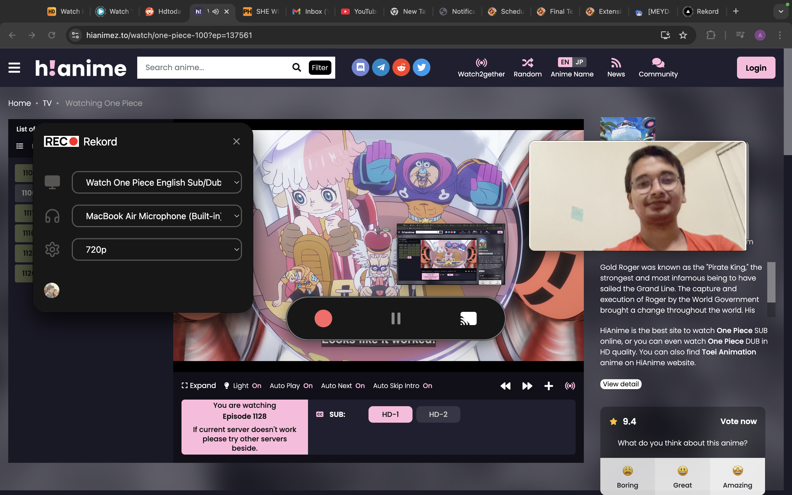

# Rekord Desktop

A modern desktop application built with Electron, React, and TypeScript for screen recording and webcam capture with real-time streaming capabilities.

[](public/rekord-desktop.png)
  *Record Videos using your computer effortlessly.*

## Tech Stack

- **Frontend Framework**: React 18
- **Language**: TypeScript
- **Build Tool**: Vite
- **Desktop Framework**: Electron
- **UI Components**: 
  - Radix UI
  - Tailwind CSS
  - Shadcn UI
- **State Management**: React Query
- **Form Handling**: React Hook Form with Zod validation
- **Authentication**: Clerk
- **Real-time Communication**: Socket.IO
- **Styling**: Tailwind CSS with animations

## Key Features

- **Multi-Window Architecture**:
  - Main application window
  - Floating studio control panel
  - Detachable webcam window
  - All windows support transparency and always-on-top functionality

- **Screen Recording**:
  - Desktop capture capabilities
  - Window and screen source selection
  - Real-time preview
  - Customizable recording settings

- **Webcam Integration**:
  - Detachable webcam window
  - Real-time video streaming
  - Adjustable window size and position
  - Always-on-top functionality

- **Real-time Communication**:
  - Socket.IO for real-time data streaming
  - IPC (Inter-Process Communication) for window management
  - Chunk-based data transfer to Record-Express application
 
## Screen Cast Preview

Rekord Desktop provides a real-time preview of your screen recording session. As you select a window or screen to record, a live cast of the selected area is displayed within the app interface. This ensures you always know exactly what is being captured, giving you full control and confidence over your recordings.

**Key Benefits:**
- Live preview of the selected screen/window
- Instantly verify what's being recorded
- Seamless integration with webcam overlay and audio selection

## Prerequisites

- Node.js (Latest LTS version recommended)
- npm or yarn
- Git

## Installation

1. Clone the repository:
```bash
git clone [repository-url]
cd rekord-desktop
```

2. Install dependencies:
```bash
npm install
# or
yarn install
```

## Development

To start the development server:

```bash
npm run dev
# or
yarn dev
```

This will start:
- Vite development server
- Electron application
- Socket.IO server for real-time communication

## Building

To create a production build:

```bash
npm run build
# or
yarn build
```

This will:
1. Compile TypeScript
2. Build the Vite application
3. Package the Electron application

## Project Structure

```
rekord-desktop/
├── electron/           # Electron main process code
│   ├── main.ts        # Main process implementation
│   └── preload.ts     # Preload scripts for IPC
├── src/               # React application source
│   ├── components/    # Reusable UI components
│   ├── hooks/         # Custom React hooks
│   ├── lib/          # Utility functions and configurations
│   └── layouts/      # Page layouts
├── public/            # Static assets
├── socket-server/     # Socket.IO server implementation
└── dist-electron/     # Built Electron files
```

## Window Management

The application uses three main windows:

1. **Main Window**:
   - Primary application interface
   - Handles core functionality
   - Frameless and transparent design

2. **Studio Window**:
   - Floating control panel
   - Resizable (400x250px default)
   - Always-on-top functionality
   - Transparent background

3. **Floating Webcam**:
   - Detachable webcam view
   - Resizable (400x200px default)
   - Always-on-top functionality
   - Transparent background

## IPC Communication

The application uses IPC for:
- Window management (show/hide/resize)
- Desktop capture source selection
- Media source handling
- Cross-window communication

## Scripts

- `npm run dev` - Start development server
- `npm run build` - Create production build
- `npm run lint` - Run ESLint
- `npm run preview` - Preview production build

## Contributing

1. Fork the repository
2. Create your feature branch (`git checkout -b feature/amazing-feature`)
3. Commit your changes (`git commit -m 'Add some amazing feature'`)
4. Push to the branch (`git push origin feature/amazing-feature`)
5. Open a Pull Request

## License

This project is licensed under the Apache License - see the [LICENSE](LICENSE) file for details.

